# PSwee Module Dependencies

This diagram shows dependencies between public (exported) and private (internal) functions in the module.

- **Green rounded rectangles**: Public functions (exported)
- **Blue rectangles**: Private functions (internal)
- **Solid arrows**: Public → Private dependencies
- **Dashed arrows**: Private → Private dependencies

```mermaid
graph TD
    N0([Start-PSWEE])
    N14[Format-FileSize]
    N15[Get-RemoteFileProperties]
    N6[Get-RemoteItems]
    N7[Invoke-Duplicate]
    N1[Invoke-GoTo]
    N8[Invoke-Move]
    N9[Invoke-PSBite-Editor]
    N10[Move-Selection]
    N2[Move-Up]
    N11[New-RemoteItem]
    N3[Open-Item]
    N12[Remove-RemoteItem]
    N13[Rename-RemoteItem]
    N4[Show-FileProperties]
    N5[Show-UI]
    N0 --> N6
    N0 --> N7
    N0 --> N1
    N0 --> N8
    N0 --> N9
    N0 --> N10
    N0 --> N2
    N0 --> N11
    N0 --> N3
    N0 --> N12
    N0 --> N13
    N0 --> N4
    N0 --> N5
    N1 -.-> N6
    N2 -.-> N6
    N3 -.-> N6
    N4 -.-> N14
    N4 -.-> N15
    N5 -.-> N14

    style N0 fill:#4CAF50,stroke:#2E7D32,stroke-width:3px,color:#fff
    style N14 fill:#2196F3,stroke:#1565C0,stroke-width:2px,color:#fff
    style N15 fill:#2196F3,stroke:#1565C0,stroke-width:2px,color:#fff
    style N6 fill:#2196F3,stroke:#1565C0,stroke-width:2px,color:#fff
    style N7 fill:#2196F3,stroke:#1565C0,stroke-width:2px,color:#fff
    style N1 fill:#2196F3,stroke:#1565C0,stroke-width:2px,color:#fff
    style N8 fill:#2196F3,stroke:#1565C0,stroke-width:2px,color:#fff
    style N9 fill:#2196F3,stroke:#1565C0,stroke-width:2px,color:#fff
    style N10 fill:#2196F3,stroke:#1565C0,stroke-width:2px,color:#fff
    style N2 fill:#2196F3,stroke:#1565C0,stroke-width:2px,color:#fff
    style N11 fill:#2196F3,stroke:#1565C0,stroke-width:2px,color:#fff
    style N3 fill:#2196F3,stroke:#1565C0,stroke-width:2px,color:#fff
    style N12 fill:#2196F3,stroke:#1565C0,stroke-width:2px,color:#fff
    style N13 fill:#2196F3,stroke:#1565C0,stroke-width:2px,color:#fff
    style N4 fill:#2196F3,stroke:#1565C0,stroke-width:2px,color:#fff
    style N5 fill:#2196F3,stroke:#1565C0,stroke-width:2px,color:#fff
```

## 📊 Summary
- **Public functions**: 1
- **Private functions**: 16
- **Public → Private dependencies**: 13
- **Private → Private dependencies**: 6
- **Total dependencies detected**: 19

## 📋 Public → Private Dependencies

### 🔹 `Start-PSWEE`
Depends on:
- `Get-RemoteItems`
- `Invoke-Duplicate`
- `Invoke-GoTo`
- `Invoke-Move`
- `Invoke-PSBite-Editor`
- `Move-Selection`
- `Move-Up`
- `New-RemoteItem`
- `Open-Item`
- `Remove-RemoteItem`
- `Rename-RemoteItem`
- `Show-FileProperties`
- `Show-UI`

## 🔗 Private → Private Dependencies

### 🔸 `Invoke-GoTo`
Depends on:
- `Get-RemoteItems`

### 🔸 `Move-Up`
Depends on:
- `Get-RemoteItems`

### 🔸 `Open-Item`
Depends on:
- `Get-RemoteItems`

### 🔸 `Show-FileProperties`
Depends on:
- `Format-FileSize`
- `Get-RemoteFileProperties`

### 🔸 `Show-UI`
Depends on:
- `Format-FileSize`

## 📈 Statistics

### Most Used Private Functions
- `Get-RemoteItems`: referenced 4 time(s)
- `Format-FileSize`: referenced 2 time(s)
- `Get-RemoteFileProperties`: referenced 1 time(s)
- `Invoke-Duplicate`: referenced 1 time(s)
- `Invoke-GoTo`: referenced 1 time(s)

### Dependency Chain Analysis
- **Private functions with dependencies**: 5
- **Leaf private functions** (no dependencies): 11
