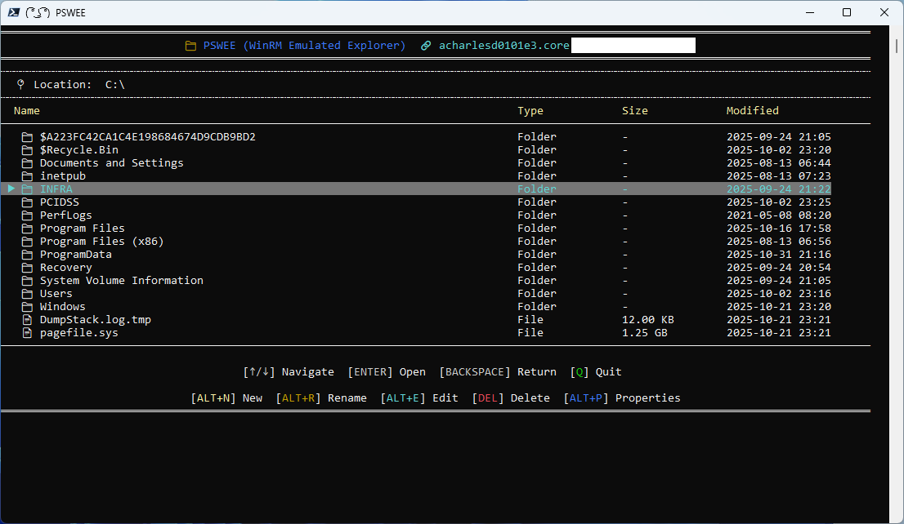

# PSWEE

**PSWEE** stand for **P**owerShell **W**inRM **Emulated** **E**xplorer. It's a console file explorer that allow you to navigate using WinRM, you can also do basic commands like add new files/folder, delete or rename files. Additionnaly the module is made to work in conjoncture with [**PSBITE**](https://github.com/arnaudcharles/PSBITE), with this you can easily edit file on the fly.

<p align="center">  </p>

## How it started

Since I was using core server, as soon as you need to manipulate file, logs or create file without GUI it was honestly a nightmare for me. Not user friendly at all because you need to remind yourself the path, sometime several path and on daily use it's just a waste of time. As Microsoft is not providing bult-in tool for this and because I'm working in a high secure area, we cannot afford to install cosmetic or non approved software. This is where the creation of this module started, because custom and selfmade PowerShell module are already running why not creating mine that can benefit my daily work and help the community ?

I already made [**PSBITE**](https://github.com/arnaudcharles/PSBITE) that is for me solving one issue and I wanted to make something link to it to benefit from both projects.

## Prerequisites

- Require PowerShell 7 (for better looking)

  Working also with PowerShell 5 (GUI will look like more basic)

- Better to have [**PSBITE**](https://github.com/arnaudcharles/PSBITE) for editing.

## Installation

To install the module from the PowerShell Gallery, you can use the following command:

```powershell
Install-PSResource -Name PSWEE
Import-Module -Name PSWEE
```

## Example of Usage

Here is a list of example that are typical use cases for the module.

### Launches PSWEE on server01 with current credentials.

```powershell
Start-PSWEE -ComputerName "server01"
```

### What it look like

#### PowerShell 7
<p align="center">  </p>

#### PowerShell 5
<p align="center">  </p>

### Find more examples

To find more examples of how to use the module, please refer to the [examples](examples) folder. Some view are available in [Views](./views/Start-PSWEE.md)

Alternatively, you can use the Get-Command -Module 'PSBITE' to find more commands that are available in the module.
To find examples of each of the commands you can use Get-Help -Examples 'CommandName'.


## Contributing

Coder or not, you can contribute to the project! We welcome all contributions.

### For Users

If you don't code, you still sit on valuable information that can make this project even better. If you experience that the
product does unexpected things, throw errors or is missing functionality, you can help by submitting bugs and feature requests.
Please see the issues tab on this project and submit a new issue that matches your needs.

### For Developers

If you do code, we'd love to have your contributions. Please read the [Contribution guidelines](CONTRIBUTING.md) for more information.
You can either help by picking up an existing issue or submit a new one if you have an idea for a new feature or improvement.
