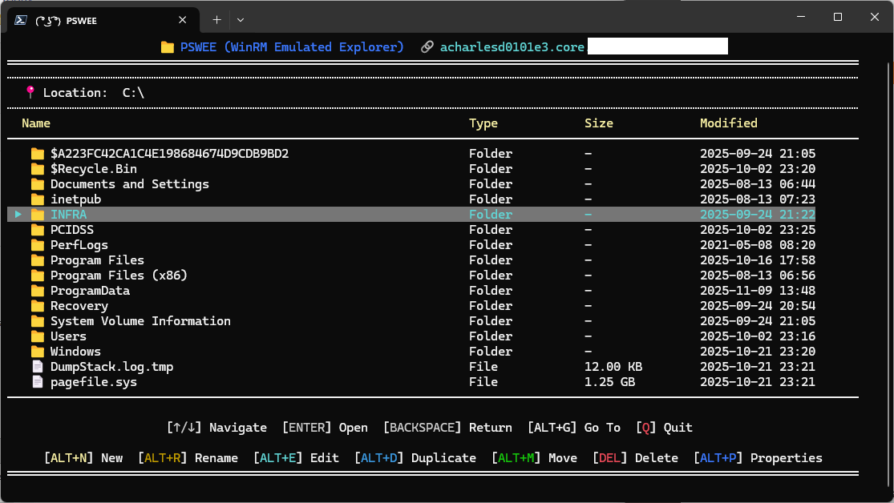
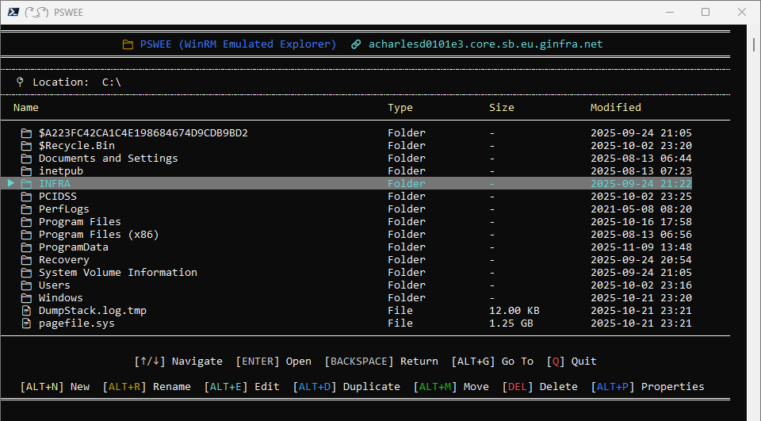

<div align="center">

# PSWEE

**PSWEE** stand for **P**owerShell **W**inRM **E**mulated **E**xplorer.
</div>

It's a console file explorer that allow you to navigate using **WinRM**, you can also do basic commands like add new files/folder, delete, move or rename files. Additionnaly the module is made to work in conjoncture with [**PSBITE**](https://github.com/arnaudcharles/PSBITE), with this you can easily edit file on the fly.

<p align="center">  </p>

<div align="center">


</div>
<br>
<br>

## 👀 What it look like

**>_ Windows Terminal**
<p align="center">  </p>

**>_ PowerShell 7**
<p align="center">  </p>


## 💪 Advantages

<table align="center">
<tr>
<td align="center" style="color: #8d2640ff">🔗<br><b>No dependency</b></td>
<td align="center" style="color: #6a741cff">🔒<br><b>Secure</b></td>
<td align="center" style="color: #3d9393ff">⌨️<br><b>Keyboard only</b></td>
<td align="center" style="color: #207bcd">📝<br><b>PSBite integration</b></td>
<td align="center" style="color: #20cda8ff">🫧<br><b>Lightweight</b></td>
</tr>
</table>

## 📄 Prerequisites

- Require PowerShell **7** (using Windows Terminal for better looking)

- Better to have [**PSBITE**](https://github.com/arnaudcharles/PSBITE) for editing.

## 📦 Installation

To install the module from the [PowerShell Gallery](https://www.powershellgallery.com/packages/PSWEE/), you can use the following command:

```powershell
Install-PSResource -Name PSWEE
Import-Module -Name PSWEE
```

## 🔩 Example of Usage

Launches PSWEE on server01 with current credentials

```powershell
Start-PSWEE -ComputerName "server01.mydomain.io"
```

💡 Feel free to create an alias in your profile `wee`, `weee`, `weeee`, `weeee` !

### Find more examples

To find more examples of how to use the module, please refer to the [examples](examples) folder. Some view are available in [Views](./views/Start-PSWEE.md)

Alternatively, you can use the Get-Command -Module 'PSBITE' to find more commands that are available in the module.
To find examples of each of the commands you can use Get-Help -Examples 'CommandName'.

## 📌 How to use it

First you need to run the function ```Start-PSWEE```

Simply navigate with the **UP** and **DOWN** arrow, **ENTER** to go further and **BACKSPACE** to return. **Q** is used to **Exit**.

We highly depend on **ALT** to interact.


* **ALT+G** -> If you know the path where you need to go, type or copy your path.
* **ALT+N** -> To create a file or folder, Let it empty to cancel.
* **ALT+R** -> To rename a file or folder. Let it empty to cancel.
* **ALT+E** -> To edit the file using PSBITE.
* **ALT+D** -> Duplicate file or folder with the same name + random number
* **ALT+M** -> Move file or folder. You can type the path or use the explorer to move where you want, if you do simply press again ALT+M to confirm the move.
* **ALT+P** -> Show the properties.
* **DEL**   -> Delete file or folder after confirmation.


## 📰 How it started

Since I was using core server, as soon as I needed to manipulate file, logs or create file without GUI it was honestly a nightmare. Not user friendly at all because you need to remind yourself the path, sometime several path and on daily use it's just a waste of time. As Microsoft is not providing bult-in tool for this and because I'm working in a high secure area, we cannot afford to install cosmetic or non approved software. This is where the creation of this module started, because custom and selfmade PowerShell module are already running why not creating mine that can benefit my daily work and help the community ?

I already made [**PSBITE**](https://github.com/arnaudcharles/PSBITE) that is for me solving one issue and I wanted to make something link to it to benefit from both projects.

## 🔧 Contributing

Coder or not, you can contribute to the project! We welcome all contributions.

### 🧑‍💻 For Users

If you don't code, you still sit on valuable information that can make this project even better. If you experience that the
product does unexpected things, throw errors or is missing functionality, you can help by submitting bugs and feature requests.
Please see the issues tab on this project and submit a new issue that matches your needs.

### 🧑‍🔧 For Developers

If you do code, we'd love to have your contributions. Please read the [Contribution guidelines](CONTRIBUTING.md) for more information.
You can either help by picking up an existing issue or submit a new one if you have an idea for a new feature or improvement.

## 📣 Ref

Thanks to [Marius](https://github.com/MariusStorhaug) for his job on [PsModule Framework](https://psmodule.io/ ) used to built the skeleton of PSWEE.